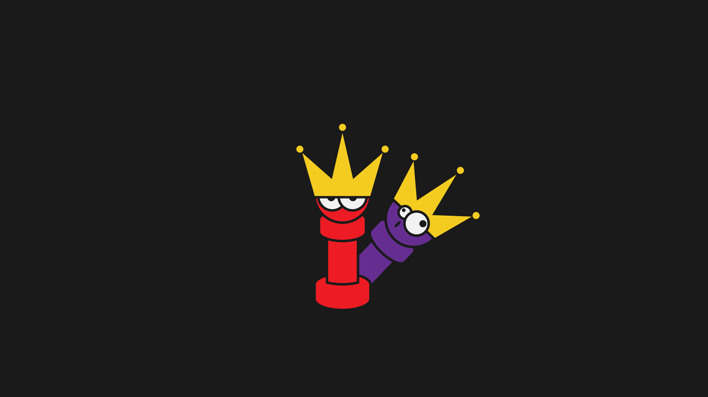

# NQueen-Genetic Algorithm  
NQueen problem with Genetic Algorithm



## The Goal  
This project aim is to test different strategies for NQueen problem and compare them according to their charts for specified problem. _for example 20Queen_  
Results can be plot on diagram and can be store on excell file for manually insert chart.   
_-Common man it's just a NQueen problem solver !_    
No ! This is not only a simple NQueen problem with Genetic Algorithm. 
* __Define your own strategy and test it for NQueen problem.__
* __Changee problem by changing Chromosome class.__ 

## Before Usage 
I used XlsxWriter module in this project.  
[XlsxWriter](xlsxwriter.readthedocs.io) is a Python module that can be used to write text, numbers, formulas and hyperlinks to multiple worksheets in an Excel 2007+ XLSX file.
Please install it by this command :   
```bash
pip install XlsxWriter
``` 

## Usage
#### How can i create my own operations ?
in Operations folder :
* __Create Parent Selection Operation :__ You are able to create your own parent selection class inside ParentSelection.py   
Your class should inherit form ParentSelection class and implement select() method.  
```python
class ParentSelection(abc.ABC) :
    # Initialization
    def __init__(self,selectionRate) :
        self.selectionRate = selectionRate
        self.selectedList = []
        self.source = None

    # Selects parents according to rate of selection
    @abc.abstractmethod
    def Select(self) :
        pass

# Your parent selection class 
class MyParentSelection(ParentSelection) :
    def select(self) :
        pass
```

* __Create Recombination Operation :__ You are able to create your own Recombination class inside Recombination.py
Your class should inherit form Recombination class and implement CanRecombinate() and RunRecombination() methodes.
```python
class Recombination(abc.ABC) :
    # Initialization
    def __init__(self,recombinationRate) :
        self.recombinationRate = recombinationRate

    # Checks if can be recombinate according to rate of recombination
    @abc.abstractmethod
    def CanRecombinate(self) :
        pass

    # Runs recombination according to rate and type
    @abc.abstractmethod
    def RunRecombination(self,chromosome1,chromosome2) :
        pass

# Your recombination class
class MyRecombination(Recombination) :
    def CanRecombinate(self) :
        pass

    def RunRecombination(self,chromosome1,chromosome2) :
        pass
```

* __Creatin Mutation Operation :__ You are able to create your own Mutaion class inside Mutation.py
Your class should inherit form Mutation class and implement CanMutate() and RunMutation() methodes.
```python
class Mutation(abc.ABC) :
    # Initialization
    def __init__(self,mutationRate) :
        self.mutationRate = mutationRate

    # Checks if can be mutate according to rate of mutation
    @abc.abstractmethod
    def CanMutate(self) :
        pass

    @abc.abstractmethod
    # Runs mutation 
    def RunMutation(self,chromosome) :
        pass

# Your mutation class 
class MyMutation(Mutation) :

    def CanMutate(self) :
        pass

    def RunMutation(self,chromosome) :
        pass
```

  
    
#### How can i define my own strategy ?
After creating operations , in root folder inside main.py make object from your operation class. 
* __Create your parent selection object :__ 
```python
myParentSelectionObject = ParentSelection.MyParentSelection()  
```
for example :    
```python
RouletWheelSelector = ParentSelection.Rouletwheel(0.6)  
```

* __Create your recombination object :__
```python
myRecombinationObject = Recombination.MyRecombination()  
```
for example :
```python
randomPointCrossOver = Recombination.RandomPointCrossOver(0.98)
```

* __Create your mutation object :__
```python
myMutationObject = Mutation.MyMutation()
```
for example :
```python
swapMutation = Mutation.Swap(0.9)
```


  
#### How can i test it ?
in root folder inside main.py create your own strategy like this and pass related parameters :  
```python
myStrategyObject = Strategy(MyParentSelectionObject,MyRecombinationObject,MyMutationObject)
myStrategyObject.name = "my strategy name"
myStrategyObject.description = "my strategy description"
RunStrategy(myStrategyObject,numberOfRuns)
``` 
for example :
```python
Strategy1 = Strategy(RouletWheelSelector,randomPointCrossOver,swapMutation)
Strategy1.name = "Strategy1"
Strategy1.description = "RouletWheelSelector,randomPointCrossOver,swapMutation"
RunStrategy(Strategy1,numberOfRuns)
```
__Attention :__ let numberOfRuns parameter have its own value and dont pass a number; because all strategies will test with same number of runs. 


  
#### How can i change problem ?
You are able to change chromosome class and test your own permutation problem without any headache.
1. You should have this properties and methodes inside your own Chromosome class in Genetic folder :
```python
class Chromosome :
    # Your length of Chromosome 
    length = int()

    # Initialization
    def __init__(self) :
        self.gensList = []
        self.collisions = int()
        self.fitness = float()
        self.AssignRandomGens()

    # Assigns unique random value for each gen
    def AssignRandomGens(self) :
        pass
    
    # Evaluates fitenss
    def EvaluateFitness(self) :
        pass
    
    # It converts Genotype to Phenotype
    # To use it for ShowBestChromosome() method in Report.py
    # and/or to use for fitness calculations
    def GenotypeToPhenoType(self) :
        pass
```
1. write your ShowBestChromosome() method inside Report.py in Genetic folder :
```python
    # Shows best chromosome that has been found
    def ShowBestChromosome(self) :
        pass
```


  
## Contributing
Pull requests are welcome. For major changes, please open an issue first to discuss what you would like to change.  


  
## Thanks
Unlimited thanks to God  
Special thanks to my master [Dr. Siamak Sarmady](https://sarmady.com/siamak/)  
hope you enjoy 🤗🌹  


  
>:blossom:Imam Mahdi(As) declared :
> we are aware of all your news 
> and none of your actions is hidden from us.
